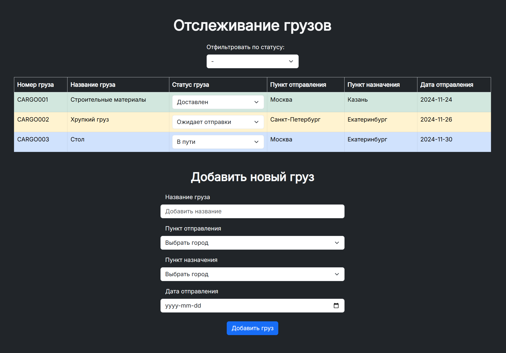

# "Cargo Tracking UI" Test Project

## Description

A landing page of the tracking system for a cargo company

### Features

1. View the list of cargoes with the current status.
2. Update the cargo status.
3. Add a new cargo for tracking.
4. Bootstrap for convenience.
5. Filtering option.
6. Error handling for incorrect statuses.

### Dependencies

`HTML` • `Bootstrap` • `JavaScript`

## Installation & Execution

1. Run `index.html` on Live Server or open it in your favorite browser
<!-- 2. Or open the [deployed version]() -->

## License

### MIT license

You can use the code, but I ask you do not copy this site without giving me credit
